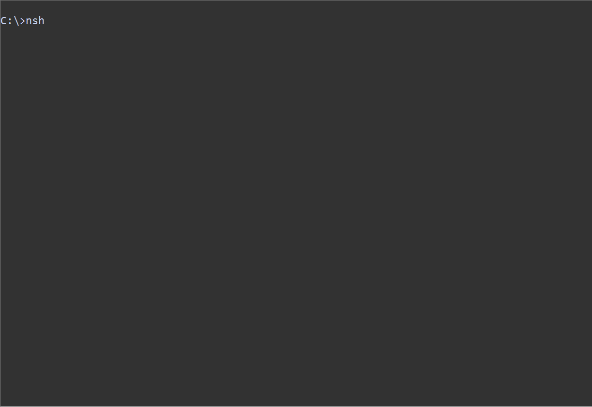

# nsh
[](https://travis-ci.org/gmshiba/nsh)
[](https://opensource.org/licenses/MIT)
[](https://github.com/yglukhov/nimble-tag)

nsh is the **SH**ell implemented on **N**im.
nsh can use not only shell commands, but also Nim code.

* Commands are implemented in 'nshpkg/unixcmd.nim' and 'nshpkg/unixcmd_script.nim'.
If you want these procs in other source code, use 'import nshpkg/unixcmd'. (If you use NimScript, use 'import nshpkg/unixcmd_script.nim'.)

* You can use 'tocl' to export nim variables to shell.

# demo



# installation

```
nimble install https://githib.com/gmshiba/nsh
```

## Warinig

* When you install nsh by nimble, probably you see this message. It's no problem. Please type 'y' to continue.

```
Prompt: Missing directory C:\pathTo\.nimble\pkgs\nsh-0.x.x\src\nshpkg. Continue? [y/N]
```

# Todo

* Implement more commands
* Tab complement

# Available commands list

| Command Name | Proc Name | Can receive value |
| :----------- | --------: | :---------------: |
| pwd          |       pwd |         ×         |
| cd           |        cd |         ×         |
| rm           |        rm |         ×         |
| ls           |        ls |         ×         |
| mkdir        |     mkdir |         ×         |
| rmdir        |     rmdir |         ×         |
| cp           |        cp |         ×         |
| mv           |        mv |         ×         |
| pushd        |     pushd |         ×         |
| popd         |      popd |         ×         |
| cat          |       cat |         ×         |
| touch        |     touch |         ×         |
| file         |      file |         ×         |
| find         |     ffind |         ×         |
| locate       |    locate |         ×         |
| more         |      more |         ×         |
| less         |      less |         ×         |
| head         |      head |         ×         |
| tail         |      tail |         ×         |
| grep         |      grep |         ○         |
| wc           |        wc |         ○         |
| sed          |       sed |         ○         |
| tee          |       tee |         ○         |
| join         |     fjoin |         ×         |
| diff         |      diff |         ×         |
| cut          |       cut |         ×         |
| uniq         |      uniq |         ×         |
| sort         |      sort |         ×         |
| nkf          |       nkf |         ×         |
| history      |   history |         ×         |
| ps           |        ps |         ×         |
| kill         |      kill |         ×         |
| lp           |        lp |         ×         |
| lpstat       |    lpstat |         ×         |
| cancel       |    cancel |         ×         |
| du           |        du |         ×         |
| ln           |        ln |         ×         |
| man          |       man |         ×         |
| which        |     which |         ×         |
| tar          |       tar |         ×         |
| id           |        id |         ×         |
| shutdown     |  shutdown |         ×         |
| reboot       |    reboot |         ×         |
| hostname     |  hostname |         ×         |
| groups       |    groups |         ×         |
| chown        |     chown |         ×         |
| chgrp        |     chgrp |         ×         |
| who          |       who |         ×         |
| whoami       |    whoami |         ×         |
| set          |      vset |         ×         |
| printenv     |  printenv |         ×         |
| watch        |     watch |         ×         |
| date         |      date |         ×         |
| sleep        |     sleep |         ×         |
| time         |      time |         ×         |
| xargs        |     xargs |         ×         |
